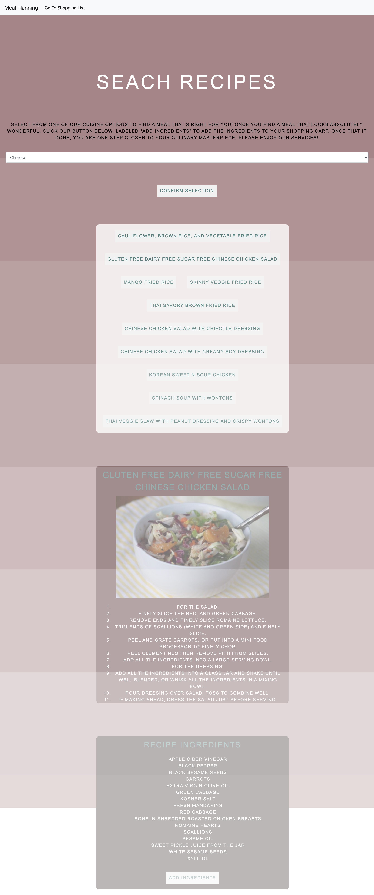
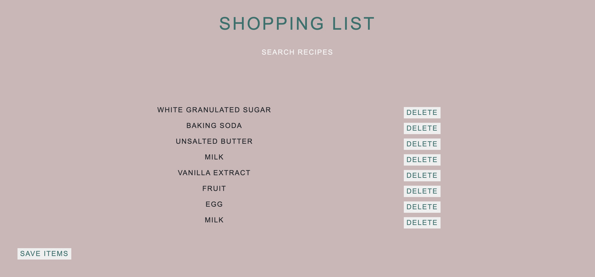

# Group Project #1 - Meal Planning Website

## Objective
The objective of this project was to create a website that has an interactive front-end application. As a group, we decided to create a meal planning website using Spoonacular as our third-party API (https://spoonacular.com/food-api). For our additional library we used Choreographer.js which set the background to continually fade as the user scrolls down the page.

Our users will:
* Come to our site and when they select a cuisine option from a dropdown box, they are presented with 8 meal recipes to select from. 
* When the user selects a recipe, they are presented with a recipe card that includes the title, a picture and the directions and a box with all of the needed ingredients. When the user decides which recipe they would like to use, they click a button to send the ingredients to a shopping list.
* The user can remove items from the shopping list as they purchase them or if they do not need to buy them. 

## Team Members
Jack Carpenter, Emily Daniel, Brandon Kemboi and Karna Sjoberg

## Screenshot of homepage

## Link to deployed code
https://kembo001.github.io/mealPlan/
